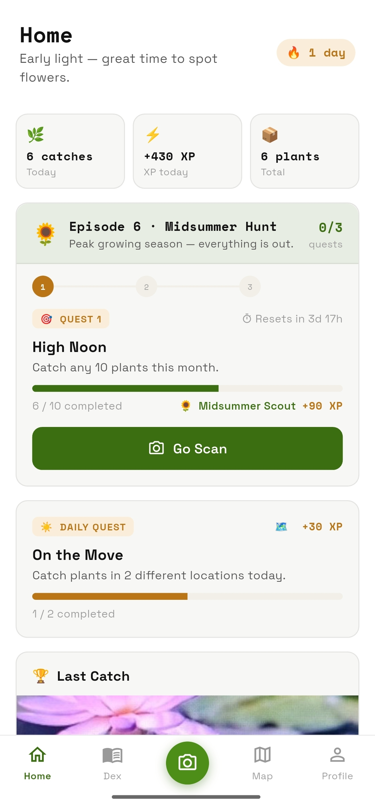
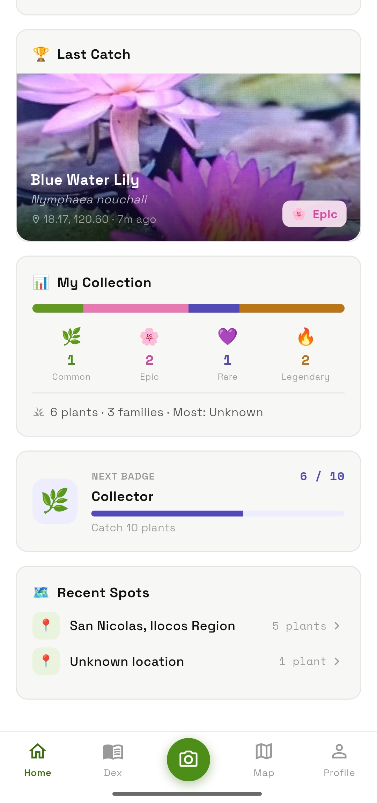
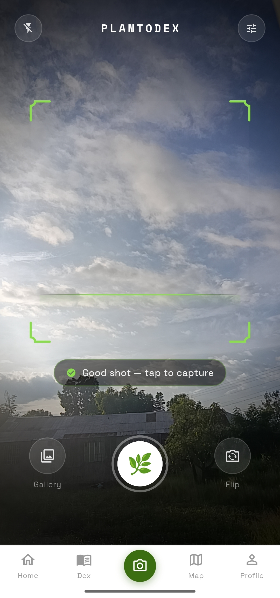
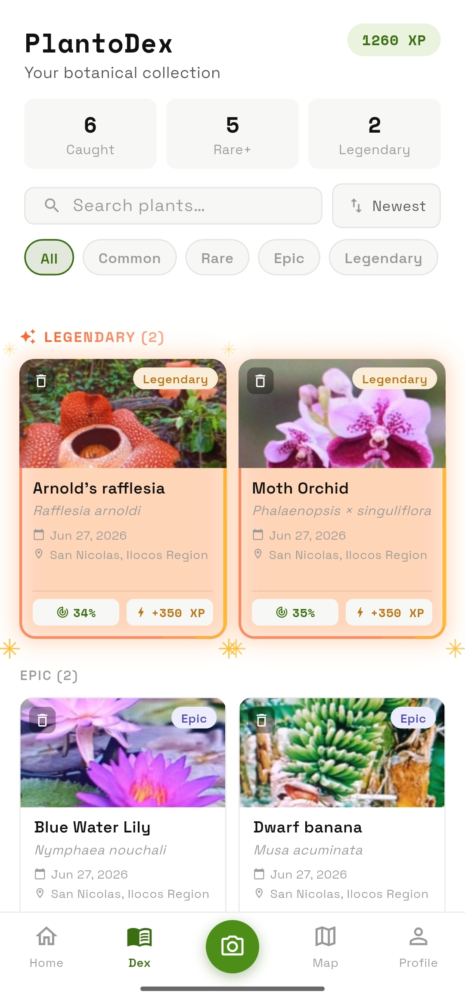
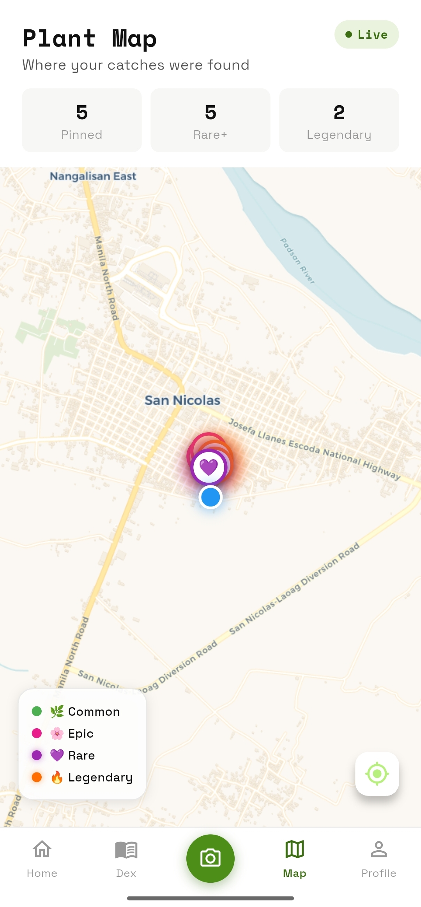
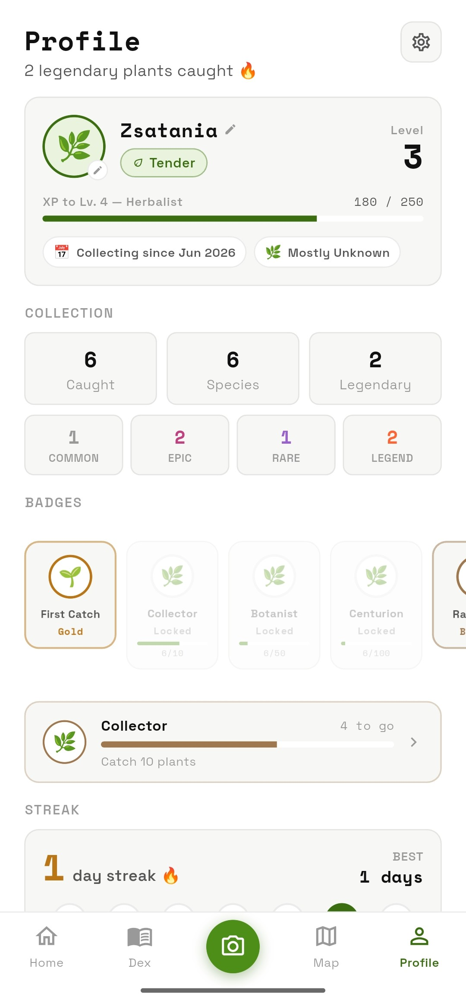
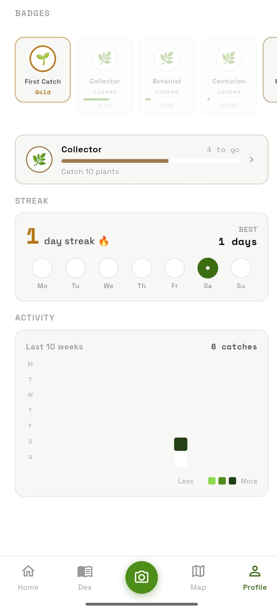

<div align="center">

# 🌿 PlantoDex

### *What if every plant was a Pokémon waiting to be caught?*

**Point your camera. Identify the plant. Catch it. Build your Dex.**  
PlantoDex turns any walk into a hunt — rarity tiers, a living collection, and a map of everywhere you've ever found something wild.


</div>

---

## The Loop

```
📷 Scan  →  🔍 Identify  →  ✨ Catch  →  📖 Collect  →  🗺️ Explore
```

That's it. Everything else — streaks, badges, a home dashboard, a live map — exists to make that loop feel *worth repeating.*

---

## Screenshots

### 🏠 Home
<p align="center">
  
  &nbsp;&nbsp;
  
</p>

### 📷 Scan &nbsp;&nbsp;&nbsp; 📖 Dex &nbsp;&nbsp;&nbsp; 🗺️ Map
<p align="center">
  
  &nbsp;&nbsp;
  
  &nbsp;&nbsp;
  
</p>

### 👤 Profile
<p align="center">
  
  &nbsp;&nbsp;
  
</p>

---

## Rarity — Powered by Real Biodiversity Data

Rarity isn't made up. It's pulled live from **GBIF** — the world's largest open biodiversity database — using the total number of globally recorded occurrences for each species.

| Tier | Global occurrences | What that means |
|---|---|---|
| 🌿 **Common** | 20,000 + | Found everywhere |
| 🌸 **Epic** | 5,000 – 19,999 | Worth noting |
| 💜 **Rare** | 1,000 – 4,999 | You got lucky |
| 🔥 **Legendary** | < 1,000 | Stop. Take a photo. |

Geographically restricted endemics — Philippine Rafflesia, Waling-waling orchids — surface as Legendary automatically. No hardcoded lists. The rarity is real.

---

## Features

### 📷 Scan
Camera-first flow with live frame quality analysis (sharpness + brightness), tap-to-focus, flash toggle, front/back flip, and a "Good shot" indicator. Captures are compressed and cropped to exactly what you framed before being sent to the ID API.

### 🔍 Identify
Powered by **Pl@ntNet** for species identification and **GBIF** for rarity classification — all resolved before the result screen opens, so there's zero flicker or partial load.

### ✨ Catch
A fully rarity-themed catch result screen with distinct animations, color gradients, and copy per tier. Common feels like a find. Legendary feels like an event.

### 📖 Dex
Your personal plant album. Grouped by rarity, searchable by name / scientific name / family, sortable by newest, A–Z, or rarity. Rare and Legendary entries get a rarity-accent border. Tap any card for full detail with a pinch-to-zoom photo viewer.

### 🗺️ Map
Every catch, pinned to where you found it — rarity-colored with glow halos on Rare and Legendary. Stacked pins spread automatically so nothing overlaps. Tap a pin for a quick info card; tap through to full detail. Reverse geocoded to real place names. No API key — pure OpenStreetMap.

### 🏠 Home
Session dashboard. Daily rotating quest (seeded by day of year so everyone's on the same mission), last catch trophy, collection snapshot, closest badge progress, and recent spots.

### 👤 Profile
XP, 10-tier level ladder (Seedling → Legendary Warden), badge collection with flip-card reveal animations, catch streaks, a 10-week activity heatmap, avatar flair that upgrades with badge count, and a 1.5× XP multiplier for hitting streak milestones. All computed live from the same database stream — no separate tracking tables.

---

## Tech Stack

| Layer | Library |
|---|---|
| UI | Flutter |
| Camera | `camera` + `image_picker` |
| Networking | `http` |
| Local storage | Floor (SQLite ORM) |
| Architecture | Provider + Repository pattern |
| Map | `flutter_map` (OpenStreetMap) |
| GPS | `geolocator` |
| Reverse geocoding | `geocoding` |
| Persistence | `shared_preferences` |

### External APIs

| API | Purpose |
|---|---|
| [Pl@ntNet](https://plantnet.org) | Plant identification from photo |
| [GBIF](https://www.gbif.org) | Occurrence-based rarity classification |
| [Wikipedia](https://www.wikipedia.org) | Species descriptions & reference info |
| [OpenStreetMap](https://www.openstreetmap.org) | Free map tiles — no API key required |

---

## Installation

> **Requires Android 6.0+ (API 23) · 2 GB RAM · rear camera · internet connection**

1. Grab the latest APK from [Releases](../../releases)
2. Enable *Install from unknown sources* on your device
3. Install and go find something Legendary

> Location can be set to "While using the app" — PlantoDex never requests background location.

---

## Project Structure

```
lib/
├── screens/         # Home, Dex, Scan, Map, Profile + sub-screens
├── services/        # Camera, frame quality, crop, geocoding, shutter sound
├── repositories/    # Floor-backed data layer (catches, map)
├── models/          # CaughtPlant entity + display models
├── providers/       # App-wide state via Provider
└── theme/           # Colors, type scale, rarity tokens
```

---

## What's Next

- **Seasonal badges** — time-gated achievements for FOMO and urgency
- **Shareable trainer card** — export your level, title, and top badges as an image
- **Settings screen** — theme toggle, data export, clear collection
- **Offline catch queue** — scan without signal, sync when back online

---

<div align="center">

Made with ☕ and probably too much love for tiny UI details.

*Go touch some grass. Catch it while you're there.*

</div>
